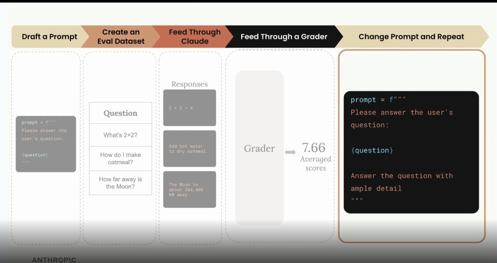
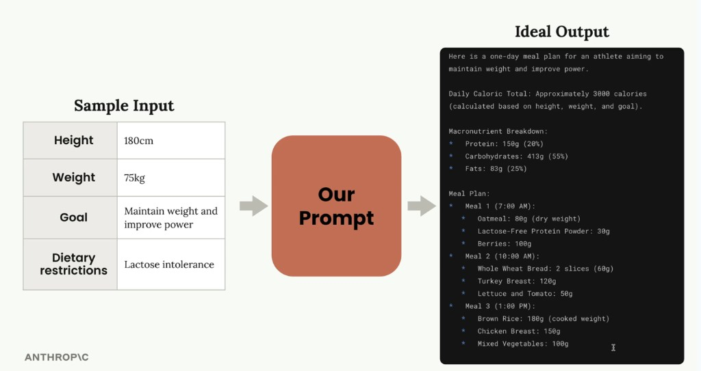
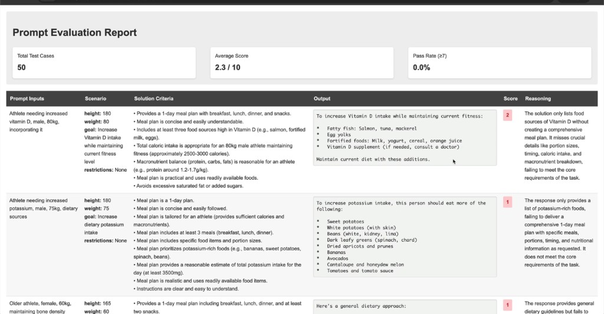
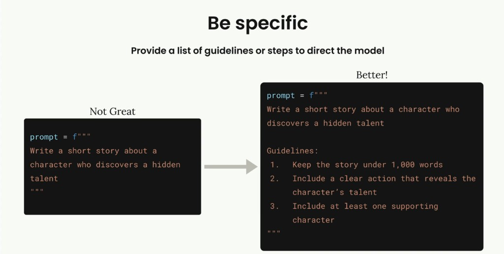
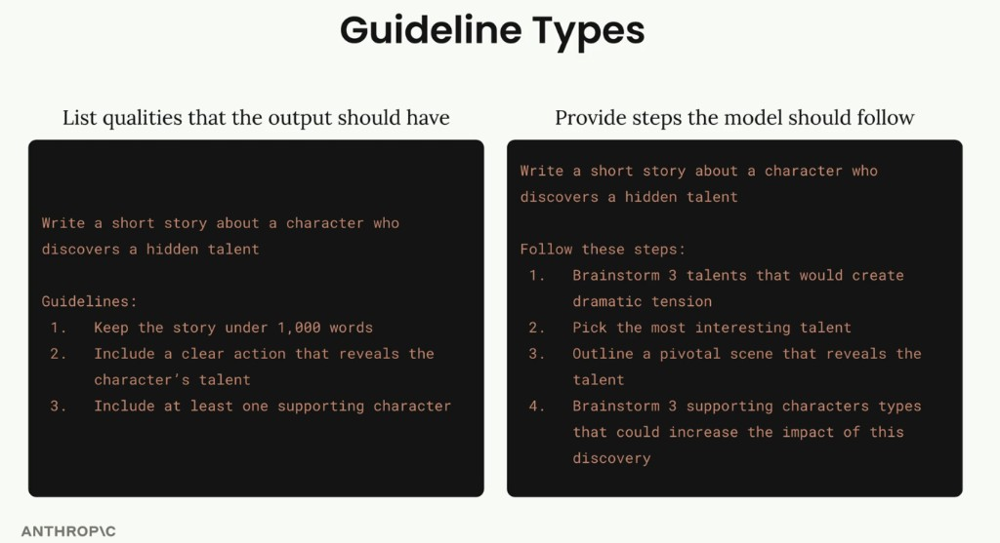
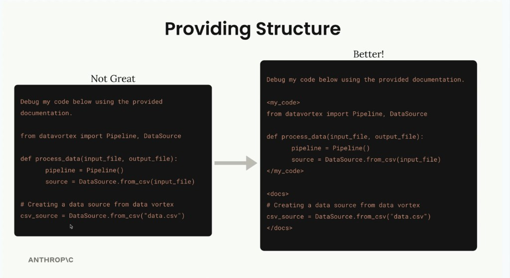
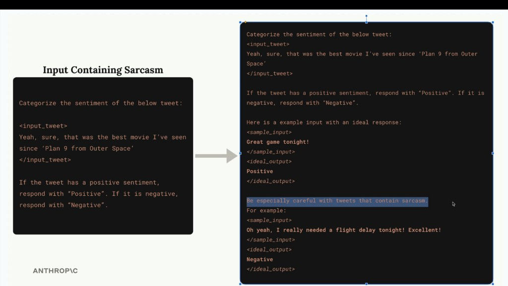

# Overview of claude models


# Working with Claude API

- When user enter a message --> Your server (add Anthropic SDK) --> Anthropic API 
-  When you hit Anthropic API --> Tokensation (Each word is a token(for simplicity we consider each word as a token)) --> Embedding each token is converted into a vector(number) -->
Contexttualisation --> Each embedding can have many meaning , Contextualisation is the process of finding the most relevant meaning of the embedding.---> Generation (final)


# Accessing Claude API
- Setting up the model
```
message = client.messages.create(
    model=model,
    max_tokens=1000,
    messages=[
        {
            "role": "user",
            "content": "What is quantum computing? Answer in two sentences"
        }
    ]
)
```
- Handling chat history , we need helper functions.
```def add_user_message(message , text):
    user_message = {role:"user", content:text}
    return user_message

def add_assistant_message(message , text):
    assistant_message = {role:"assistant", content:text}
    return assistant_message

def chat(message):
    message = client.messages.create(
        model=model,
        max_tokens=1000,
        messages=message
    )
    return message.content[0].text

# Start with an empty message list
messages = []

# Add the initial user question
add_user_message(messages, "Define quantum computing in one sentence")

# Get Claude's response
answer = chat(messages)

# Add Claude's response to the conversation history
add_assistant_message(messages, answer)

# Add a follow-up question
add_user_message(messages, "Write another sentence")

# Get the follow-up response with full context
final_answer = chat(messages)

add_assistant_message(messages, final_answer)

# Print the entire conversation history
print(messages)


```
- A Simple chatbot
```
messages = []

while True:
    user_input = input(">")
    user_message = add_user_message(messages, user_input)
    res = chat(user_message)
    final_ans = add_assistant_message(messages, res)
    print(">", final_ans)
```


- Adding System Prompt
```
def chat(message , system_prompt):
    params = {
        "model": model,
        "max_tokens": 1000,
        "messages": message,
    }
    if system_prompt:
        params["system"] = system_prompt
 
    message = client.messages.create(**params)
    return message.content[0].text
```

- Temperature --> chooses the next word with the highest probability if temperature is 0.0 , it will choose the most likely word. if temperature is 1.0 , it will choose the least likely word.In real word , it is used to choose whether to be creative or more deterministic.

- Streaming --> When user sends a message , sometimes claude may not give the response immediately , which is bad user experience. So, we use streaming to give the response in chunks.

```
with client.messages.stream(
    model=model,
    max_tokens=1000,
    messages=messages
) as stream:
   for text in stream.text_stream:
       print(text, end="")
```

- structured output --> When user asks for a structured output for ex: only json , bullet points etc
```
messages = []
add_user_message(messages, "Generate a sample JSON")
add_assistant_message(messages, "```json")
text = chat(messages , stop_sequences=["```"])
```

# Prompt Evaluation
Basically setting objective metric to evaluate the prompt.
- There are some open souce tools and paid tools are also available
- Steps to make a custom prompt evaluator



- Then compare the two avg scores to evaoluate the prompt
[Go to code example](Practice/001_prompt_evals.ipynb)

- Grade by model [Go to code example](Practice/001_prompt_evals.ipynb)

- Then Grade by syntax [Go to code example](Practice/001_prompt_evals_fns.ipynb) --> Basically we need helper functions to parse  the output and in the dataset need to include format field.

# Prompt Engineering
Our Goal



Steps for Prompt Engineering

1. Set a Goal
2. Writa an intial prmopt
3. Evaluate the prompt 
4. Apply Prmopt Engineering Techniques
5. Reevaluate and iterate


[Go to code example](Practice/001_prompting.ipynb)

After running it will genrate an HTML file where you can see the scores and other details.



1. First Prompt Engg technique is be clear and direct --> hint : start the prompt with an action verb.
 EX : Generate a diet meal plan for an athlete that meets their dietary restrictions.
2. Being specific --> That is too guildelines or steps . We need to add guidelines almost all the time
except during critical thinking tasks like writing code , etc.





Code Example [Go to code example](Practice/001_prompting.ipynb)

3. Use XML Tags --> It will provide structure to the prompt.



4. Providing examples ---> 
   one shot - single example
   Multi shot - multiple examples
   Better use it xml tags to get better results.
   Also add ideal output with a proper reasoning.For Ex
  
   <ideal_output></ideal_output>

   <ideal_output_reasoning>
   </ideal_output_reasoning>



   

